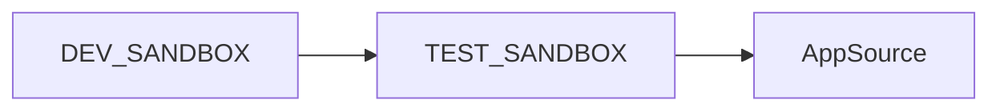
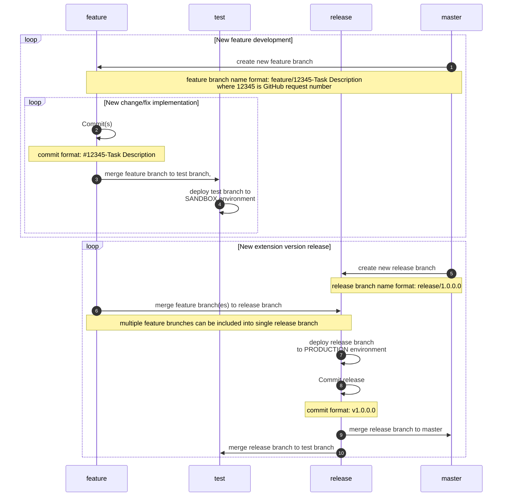

# **Business Central Environments**

## DEV_SANDBOX
Purpose: Development and testing

Link: https://businesscentral.dynamics.com/9b6a813b-7d80-4976-bf5e-10b1b7b5dc88/Sandbox](https://businesscentral.dynamics.com/98a9a56b-05b0-4d5c-95e2-37f22a0b5c6b/SKG-BCS-DEV01/
Repo Branch: test

## TEST_SANDBOX
Purpose: Environment for user acceptance testing

Link: https://businesscentral.dynamics.com/9b6a813b-7d80-4976-bf5e-10b1b7b5dc88/Test](https://businesscentral.dynamics.com/98a9a56b-05b0-4d5c-95e2-37f22a0b5c6b/SKG-BCS-TST01/
Repo Branch: uat

# **Delivery Path**

# **Repository Workflow**

