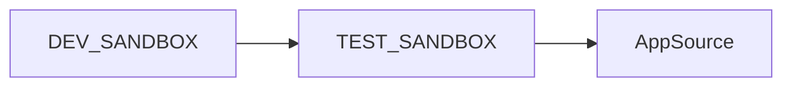
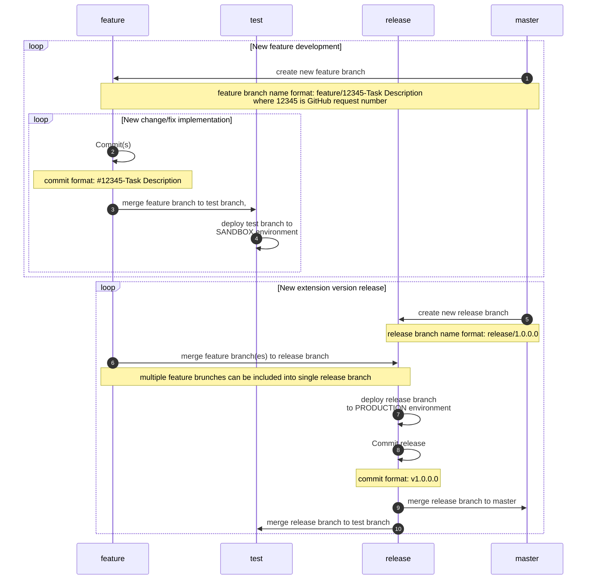

``` mermaid
graph LR;
    DEV_SANDBOX-->TEST_SANDBOX;
    TEST_SANDBOX-->AppSource;
```

```mermaid
sequenceDiagram
    autonumber
    participant feature
    participant test
    participant release
    participant master

    loop New feature development
        master->>feature: create new feature branch
        Note over master,feature: feature branch name format: feature/12345-Task Description <br> where 12345 is GitHub request number

        loop New change/fix implementation
            feature->>feature: Commit(s)
            Note over feature,feature: commit format: #35;12345-Task Description

            feature->>test: merge feature branch to test branch, 
            test->>test: deploy test branch to <br> SANDBOX environment                  
        end
    end

    loop New extension version release
        master->>release: create new release branch
        Note over master,release: release branch name format: release/1.0.0.0

        feature->>release: merge feature branch(es) to release branch
        Note over feature,release: multiple feature brunches can be included into single release branch
        release->>release: deploy release branch <br>to PRODUCTION environment
        release->>release: Commit release
        Note over release: commit format: v1.0.0.0
        release->>master: merge release branch to master

        release->>test: merge release branch to test branch
    end
```
